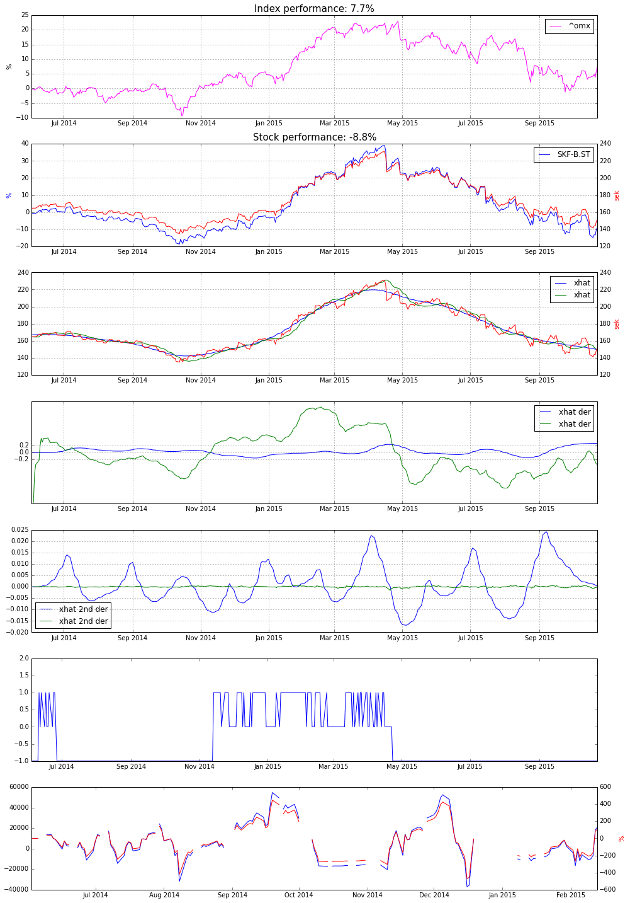

# Rikedom
An algorithmic trading library in Python. 

## How to use
Best used in Jupyter notebooks. [Check out example]("notebooks/html_exports/HodrickPrescottAlgorithm.html)

```python
today = datetime.today().date()

start = datetime(2014, 6, 2)
end = datetime(today.year, today.month, today.day)

cherrypick_portfolio = [
    'SKF-B.ST', # SKF. industry. beta 1.12
    'AZN.ST', # astra zeneca. medicine
    'VOLV-B.ST', # Volvo. industry. beta 1.54
    'AXFO.ST', # axfood. food. beta 0.48
    'INVE-B.ST', # investor. property and finance. beta 1.03,
    'SAND.ST', # sandvik. industry. beta 1.21,
    'AAK.ST', # food. 0.63,
    'ALFA.ST', # alfa laval. industry. 1.0
    #'ASSAB.ST', # assa abloy (locks). industry. beta 0.89
    'NCC-A.ST', # NCC. construction. 1.22
    'WALL-B.ST', # wallenstam. property. 0.63,
    #'STL.OL', #statoil. norwegian. 1,08
    'FING-B.ST',
    'VITR.ST',
    '^OMX', # stockholm index
    'BSE-100.BO', # india index.
    '^N225', # japan index
    'AAPL',
    'KO',
    'DUK',
    'TGT',
    'TSLA',
    'MSFT',
]

hp_algo = HodrickPrescottAlgorithm()
hp_algo.run_algorithm(portfolio, start, end)

index_data = load_from_yahoo(stocks=['^omx'], indexes={}, start=start, end=end)
index_performance = index_data['^omx'][-1] / index_data['^omx'][0]*100-100

for stock_name in portfolio:
    last_date = hp_algo.data[hp_algo.data[stock_name].notnull()].index[-1]
    print '{: <16}{}'.format(stock_name, last_date)
```

From the data you can create some plots. [Check out example]("notebooks/html_exports/HodrickPrescottAlgorithm.html)




## Support my creation of open source software:
[](https://flattr.com/submit/auto?user_id=sebnil&url=https://github.com/sebnil/rikedom)

<a href='https://ko-fi.com/A0A2HYRH' target='_blank'></a>